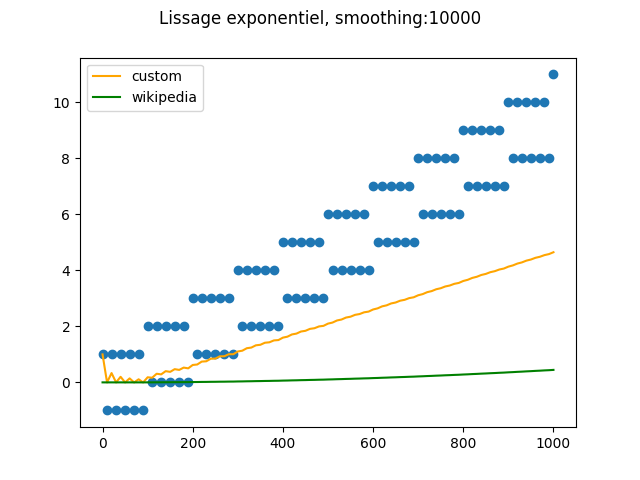
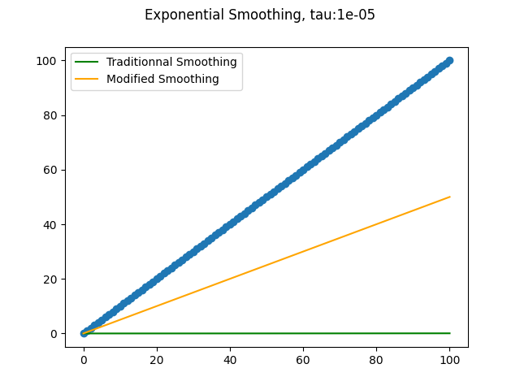

# Exponential smoothing adapted to IoT flows
*Jerome Dejaegher*

## 1. Exponential smoothing ##

Exponential smoothing is a known technique to smooth data, and is defined as :

$ S(x_n) = (1 - {e^{-\alpha}}) * x_n + e^{-\alpha}*S(x_{n-1})$

$ S(0) = x_{0}$ 

Starting from the first point of the serie x(t), each new point is defined as a weighted average between the previous average and the new point. The exponential decay defines the speed of forgetting of the smoothing, higher alpha putting more weight to the newest value, and lower alpha putting more weight to the previous smoothed value.

## 2. A limit of exponential smoothing ##

As a consequence, this smoothing has two major drawbacks :

- where alpha is high, $ S(x_n) $ is equal to $ x_n $ (no memory, no smoothing)
- where alpha is low, $ S(x_n) $ is nearly constant (no update).

With classical time serie, these drawbacks are not an issue, because why would you choose one of these extrems values ?

However, with the time series obtained from IoT, time stamps are not uniformly distributed, and the formula for exponential smoothing are now defined as : 

$ S[x(t_n)] = (1 - e^{-\frac{\Delta t_n}{\tau}}) * x(t_n) + e^{-\frac{\Delta.t_n}{\tau}}*S[x(t_{n-1})]$

$ S(0) = x_{0}$ 

Now, with high $\Delta t_n$ value, the smoothing function "forgets" the past, and with low $\Delta t_n$ value, the smoothing function does not include new value. 

Can we correct these drawbacks, to permit arbitrary short and long interval updates ?

## 2. A proposal to fix exponential smoothing ##

We want two property of the modified exponential smoothinig :

1. Firstly, we want to keep an exponential decay of terms composing the exponential smoothing. Last values weights more than older ones;

2. Secondly, we want to keep the property that the weights sums to 1. This ensure the average is in the convex hull of all values.

The simpler formula that satisfies these two properties is maybe this one :

$$ EMA(x[t_n]) = \frac{\sum_{k=0}^n e^{\frac{t_k - t_n}{\tau}}*x[t_n]}{\sum_{k=0}^n e^{\frac{t_k - t_n}{\tau}}}$$

Let us call the denominator Z(t), as it can be seen as a partition function. Then, one can easily found that this smoothing function is defined by the following properties :

$ Z(t_n) * EMA(x[t_n]) = x[t_n] + e^{-\frac{\Delta t_n}{\tau}} * Z(t_{n-1})*EMA(x[t_{n-1}])$

$ Z(t_n) = 1 + e^{-\frac{\Delta t_n}{\tau}}*Z(t_{n-1})$

$ EMA(0) = x_{0}$ et 
$ Z(0) = 1 $

Now, when $ \Delta t_n $ is close to 0, there is no more a discard of the new value, which is weighted as $\frac {1}{1 + Z(t_{n-1})}$.

figure 1 : examples of how exponential smoothing is not updated when $ \Delta t_n $ is close to 0. The modified formula struggle to follow the trend, but is significantly updated from the initial [-1, 1] range.

However, when $ \Delta t_n $ is very large, there is still a forgetting of history, which is coherent with the fact than a large $ \Delta t_n $ means that the new value comes after a very long time, justifying the oblivion of the past.

## 3. Equivalence when timestamps are equaly distributed ##

At this point of the demonstration, one can ask : if these drawbacks were so huge, why the old formula was developped ? 

The reason is simple : with old sensor, that sample value at periodic time, the two formula are nearly identical. The difference arise only when $ \Delta t_n $ vary too much compared to the $ \tau $ value.

When timestamps are equaly distributed, 

$ Z(t_n) = \sum_{k=0}^n e^{\frac{k.\Delta t}{\tau}} = \frac{1 - e^{\frac{(n+1)\Delta t}{\tau}}}{1 - e^{\frac{\Delta t}{\tau}}}$, so 

$ Z(t_n) * EMA(x[t_n]) = x[t_n] + e^{-\frac{\Delta t_n}{\tau}} * Z(t_{n-1})*EMA(x[t_{n-1}])$
$(1 - e^{\frac{(n+1)\Delta t}{\tau}}) . EMA(x[t_n]) = (1 - e^{\frac{\Delta t}{\tau}}).x[t_n] + e^{-\frac{\Delta t_n}{\tau}} . (1 - e^{\frac{n\Delta t}{\tau}}).EMA(x[t_{n-1}])$

When n goes to inifinity, we find : 

$EMA(x[t_n]) = (1 - e^{\frac{\Delta t}{\tau}}).x[t_n] + e^{-\frac{\Delta t_n}{\tau}} .EMA(x[t_{n-1}])$, which is the classical formula for exponential smoothing.

## 4. Conclusion ##

When timestamps are not uniformly distributed, and especially when we deal with data from IoT sensor, it makes sense to modify the classical formula of exponential smoothing, with the folowing formula : 

$$ EMA(x[t_n]) = \frac{\sum_{k=0}^n e^{\frac{t_k - t_n}{\tau}}*x[t_n]}{\sum_{k=0}^n e^{\frac{t_k - t_n}{\tau}}}$$

Or equivalently :

$ Z(t_n) * EMA(x[t_n]) = x[t_n] + e^{-\frac{\Delta t_n}{\tau}} * Z(t_{n-1})*EMA(x[t_{n-1}])$

$ Z(t_n) = 1 + e^{-\frac{\Delta t_n}{\tau}}*Z(t_{n-1})$

$ EMA(0) = x_{0}$ et 
$ Z(0) = 1 $

When timestamps are uniformly distributed, the two formula gives similar results. Thus, it appears reasonable to use this formula in every case.